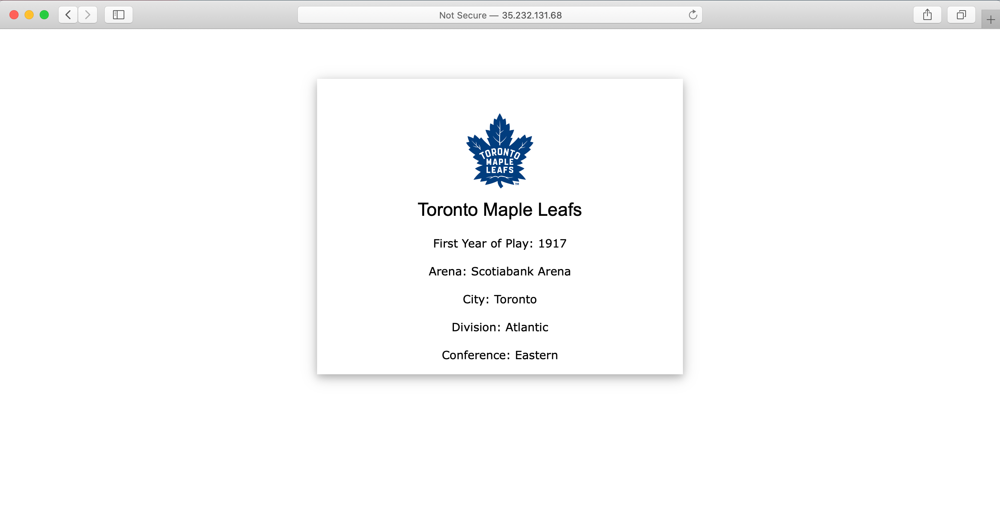

# Random Sports Team
Demo Python application showing random NHL Sports teams.



## How to Build
```shell
$ docker build --tag random-sports-team .

$ docker tag random-sports-team jacobmammoliti/random-sports-team

$ docker push jacobmammoliti/random-sports-team
```

## Deploy into Kubernetes
```shell
$ kubectl create deployment random-sports-team --image=jacobmammoliti/random-sports-team

$ kubectl expose deployment random-sports-team --port 8080

$ kubectl port-forward svc/random-sports-team 8080:
```